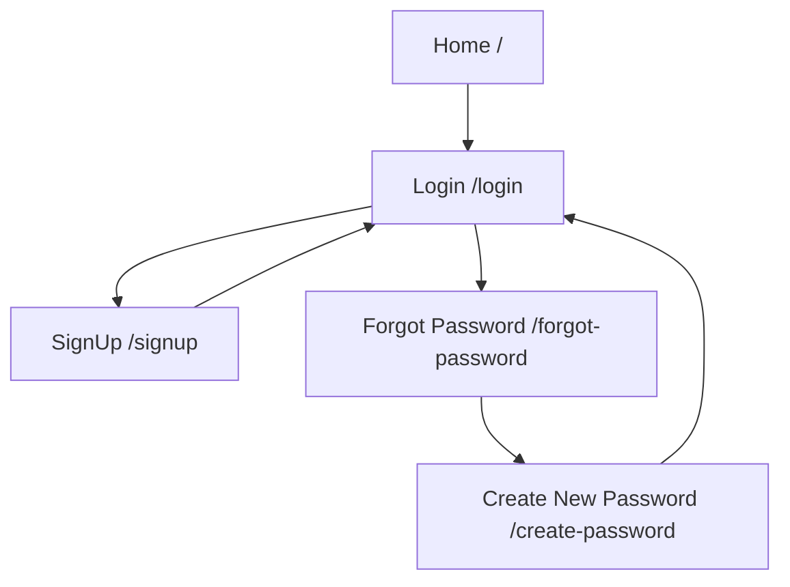

# 👤 FitConnect Authentication Portal

A beautiful, responsive Login/SignUp portal built with React.js for the FitConnect platform.

## 🎨 Design Features

- **Dark Theme:** Modern `#2b2b2b` background
- **Accent Colors:** Purple gradient (`#aa7aec`, `#7a82f0`)
- **Typography:** Poppins font family
- **Responsive:** Mobile-first design approach
- **Smooth Animations:** Professional transitions and hover effects

## 📦 Components

### 1. Login Component (`/login`)
- Email authentication
- Password with visibility toggle
- Social login integration (Instagram, Facebook)
- Link to SignUp page

### 2. SignUp Component (`/signup`)
- Email registration
- Phone number input
- Password with confirmation
- Terms & Conditions acknowledgment
- Social signup options
- Link to Login page

### 3. Forgot Password Component (`/forgot-password`)
- Email input for password reset
- Clean, focused interface
- Automatic navigation to password reset

### 4. Create New Password Component (`/create-password`)
- New password input
- Password confirmation
- Minimum length validation
- Password visibility toggles

## 🚀 Quick Start

```bash
# Navigate to client directory
cd client

# Install dependencies
npm install

# Start development server
npm start
```

## 📋 Requirements

- Node.js 18+
- npm or yarn
- React 18+
- React Router DOM 6+

## 🔧 Dependencies

```json
{
  "react": "^18.2.0",
  "react-dom": "^18.2.0",
  "react-router-dom": "^6.20.0",
  "lucide-react": "^0.263.1"
}
```

## 📱 Routes

| Route | Component | Description |
|-------|-----------|-------------|
| `/` | Redirect | Redirects to `/login` |
| `/login` | Login | User login page |
| `/signup` | SignUp | User registration page |
| `/forgot-password` | ForgotPassword | Password recovery page |
| `/create-password` | CreateNewPassword | New password setup page |

## 🎯 Navigation Flow



## 🎨 Color Palette

| Color Name | Hex Code | Usage |
|------------|----------|-------|
| Background | `#2b2b2b` | Main background |
| Primary Accent | `#aa7aec` | Titles, links, icons |
| Gradient Start | `#7a82f0` | Card strip gradient |
| Gradient End | `#8a7aec` | Card strip gradient |
| Text Primary | `#ffffff` | Main text |
| Text Secondary | `#a0a0a0` | Descriptions |
| Input Background | `#f5f5f5` | Form inputs |

## 📝 Form Validations

### Login
- Email: Valid email format required
- Password: Non-empty required

### SignUp
- Email: Valid email format required
- Phone: Valid phone number required
- Password: Minimum 8 characters
- Confirm Password: Must match password

### Forgot Password
- Email: Valid email format required

### Create New Password
- Password: Minimum 8 characters
- Confirm Password: Must match password

## 🔐 Security Features

- Password visibility toggle
- Client-side validation
- Prepared for JWT integration
- Secure form submission handling

## 🎯 Future Enhancements

- [ ] Backend API integration
- [ ] JWT authentication
- [ ] Social OAuth implementation
- [ ] Email verification
- [ ] Two-factor authentication
- [ ] Remember me functionality
- [ ] Loading states
- [ ] Error toast notifications
- [ ] Success animations

## 🧪 Testing

```bash
# Run tests (when implemented)
npm test

# Build for production
npm run build

# Preview production build
npm run serve
```

## 📁 File Structure

```
src/
├── components/
│   ├── Login.jsx              # Login component
│   ├── Login.css              # Login styles
│   ├── SignUp.jsx             # SignUp component
│   ├── SignUp.css             # SignUp styles
│   ├── ForgotPassword.jsx     # Forgot password component
│   ├── ForgotPassword.css     # Forgot password styles
│   ├── CreateNewPassword.jsx  # Create password component
│   └── CreateNewPassword.css  # Create password styles
├── App.jsx                    # Main app with routes
├── index.js                   # Entry point
└── index.css                  # Global styles
```

## 🤝 Contributing

1. Fork the repository
2. Create your feature branch (`git checkout -b feature/AmazingFeature`)
3. Commit your changes (`git commit -m 'Add some AmazingFeature'`)
4. Push to the branch (`git push origin feature/AmazingFeature`)
5. Open a Pull Request to the `dev` branch

## 📸 Screenshots

### Login Page
- Clean, modern interface
- Password visibility toggle
- Social login options

### SignUp Page
- Multi-field registration
- Terms acceptance
- Social signup options

### Forgot Password
- Simple email input
- Clear instructions

### Create New Password
- Dual password fields
- Visual validation feedback

## 🐛 Known Issues

None at the moment. Please report issues on GitHub.

## 📞 Support

For support, please:
1. Check the SETUP_GUIDE.md
2. Review the troubleshooting section
3. Open an issue on GitHub
4. Contact the maintainers

## 👥 Authors

- **GSSoC'25 Contributors** - Initial work

## 📄 License

This project is licensed under the MIT License - see the LICENSE file for details.

## 🙏 Acknowledgments

- Design inspiration from modern fitness apps
- Icons from Lucide React
- Fonts from Google Fonts (Poppins)
- FitConnect team and contributors

## 🔗 Related Links

- [Main Repository](https://github.com/Varunshiyam/Fit-Connect)
- [Contributing Guidelines](../CONTRIBUTING.md)
- [Code of Conduct](../CODE_OF_CONDUCT.md)
- [Issue Templates](../.github/ISSUE_TEMPLATE/)

---

**Built with ❤️ for GSSoC'25**